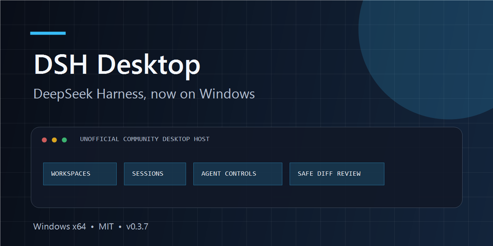
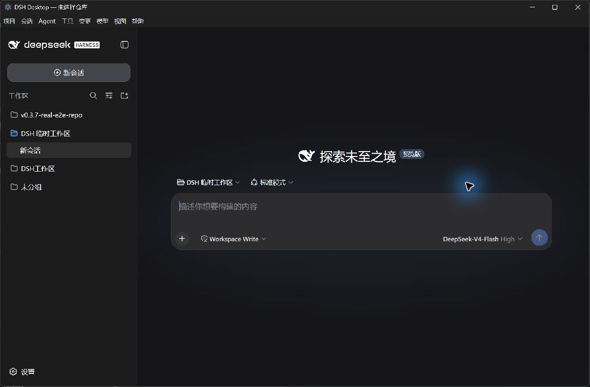

# DSH Desktop

<p align="center">
  
</p>

<p align="center">
  <strong>An unofficial Windows desktop host for DeepSeek Harness.</strong><br>
  Open local repositories, keep sessions, control the running agent, and review changes without rebuilding the official agent loop.
</p>

<p align="center">
  <a href="https://github.com/hejiahang0001-oss/dsh-desktop/releases/latest/download/DSH-Desktop-Setup-0.5.4.exe"><strong>Download for Windows</strong></a>
  · <a href="#quick-start">Quick start</a>
  · <a href="#中文说明">中文说明</a>
  · <a href="DSH_DESKTOP_ITERATION_PLAN.md">Roadmap</a>
</p>

<p align="center">
  <a href="https://github.com/hejiahang0001-oss/dsh-desktop/releases"></a>
  <a href="https://github.com/hejiahang0001-oss/dsh-desktop/actions/workflows/ci.yml"></a>
  <a href="LICENSE"></a>
  
</p>

> [!IMPORTANT]
> DSH Desktop is an independent community project. It is not affiliated with, endorsed by, or maintained by DeepSeek. DeepSeek Harness remains a developer preview; this release pins `@deepseek-ai/dsh@0.1.1-rc.2`.

## Why DSH Desktop

DeepSeek Harness already provides the agent and Web UI. DSH Desktop adds the Windows product shell around it:

- **Native workspace flow** — open a local Git repository with `Ctrl+O`, remember recent repositories, and bind the matching Harness workspace and session.
- **Persistent sessions** — create, search, resume, rename, archive, and branch sessions while keeping Harness as the source of truth.
- **Agent visibility and control** — see whether the agent is idle, running, waiting for approval, or unavailable; stop or redirect a running turn from native menus.
- **Persistent Git review panel** — keep a bounded real Diff beside Harness, resize or hide the panel, and accept or reject one file or a safe batch while protecting pre-existing edits.
- **Workspace file browser** — lazily browse the active Harness workspace, search bounded filenames, open safe text files in a read-only Quick Look surface, and reveal the selected Diff file in the tree.
- **Isolated workspace terminal** — open an explicitly confirmed persistent Windows PowerShell PTY in a local-only terminal window. Harness can open or focus that window but cannot start, write, resize, stop, or read its output; the software-managed DeepSeek Key remains outside the terminal environment.
- **Integrated application preview** — open workspace HTML through a software-managed random loopback port or connect to an existing localhost development server, with explicit ready/offline/stopped states and owned-port cleanup.
- **Image and PDF Quick Look** — safely inspect PNG, JPEG, WebP, GIF, and PDF files in memory with fit, zoom, and PDF page controls; supported mislabelled images are identified by their real format.
- **Global command palette** — press `Ctrl+Shift+P` to search and run a fixed, keyboard-accessible allowlist of workbench actions without exposing arbitrary shell or JavaScript execution.
- **Recoverable layout** — scale the complete interface from 80% to 140%, reset all panels and dimensions in one action, and retain compact 1024×720 keyboard access.
- **Automatic code checkpoints** — snapshot the current repository through a temporary Git index before an Agent turn, deduplicate unchanged state, exclude credential-like paths, and leave the branch, working tree, and real index untouched.
- **Confirmed checkpoint recovery** — preview a bounded restore, create a safety point, preserve sensitive files and their staged state, recycle newly created files, and recover without moving the branch or HEAD.
- **Bounded checkpoint history** — inspect the latest twelve verified local safety points, compare their real impact, and choose an older target without exposing commit or ref input.
- **Checkpoint-linked conversation branches** — associate new checkpoints with the selected completed Harness turn, then either restore code only or create and switch to an official child session while preserving the source conversation.
- **Visible context sources** — inspect the Code preset, desktop language policy, project-rule candidate chain, and durable-session boundary in a local read-only window without exposing hidden prompts, credentials, or rule contents; Harness remains authoritative for content deduplication and prompt-budget inclusion.
- **Extension health and safe toggles** — inspect the fixed Harness dependency closure, shared fallback links, initialized Profiles, ordered bundle layers, and Profile-declared pnpm dependencies; only already-installed external bundle dependencies can be enabled or disabled through a confirmed, atomic, rollback-capable restart.
- **Controlled extension installation** — install the reviewed `@nonamelego/dsh-catppuccin@0.3.1` catalog entry into the Web Profile with bundled pnpm `11.19.0`, exact-version/integrity checks, disabled lifecycle scripts, native confirmation, credential isolation, health verification, and rollback. No arbitrary package or pnpm command input is exposed.
- **In-app network settings** — choose direct access, the current Windows system proxy, or a credential-free custom HTTP(S) proxy; test DeepSeek connectivity before saving and keep loopback services and the integrated terminal outside that route.
- **Reliable copy actions** — Harness can write sanitized text to the clipboard from its trusted main page, while clipboard reads, subframes, and unrelated permission requests remain denied.
- **Packaged runtime** — the installer includes pinned Node.js and Harness runtimes; users do not need to install Node.js first.
- **Constrained desktop shell** — loopback-only service, random port, renderer sandbox, context isolation, no Node integration, and restricted navigation.

<p align="center">
  
</p>

## Quick start

1. Download [`DSH-Desktop-Setup-0.5.4.exe`](https://github.com/hejiahang0001-oss/dsh-desktop/releases/latest/download/DSH-Desktop-Setup-0.5.4.exe).
2. Install and launch DSH Desktop. The current installer is not code-signed, so Windows SmartScreen may show a warning.
3. Open **Project → Open code repository…** or press `Ctrl+O`.
4. Open **Model** to configure your DeepSeek API key, then start a Harness session.

The application stores profiles, sessions, settings, logs, and repository state under `%APPDATA%\DSH Desktop`; upgrades do not remove this data.

## Current releases

**V0.5.15 product Latest candidate** keeps official DeepSeek Harness `0.1.1-rc.2`, Electron `43.4.1`, and bundled pnpm `11.19.0`. The fixed catalog now supports native-confirmed install, reviewed `0.3.0`→`0.3.1` upgrade, uninstall, enable/disable, and one-step last-known-good rollback for `@nonamelego/dsh-catppuccin`. Persistent journals recover an interrupted owned mutation on startup and block the Profile instead of overwriting a conflicting external edit. `DSH-Desktop-Setup-0.5.15.exe` is published as a Pre-release only after package, overwrite, installed-smoke, CI, and remote-asset gates pass. The front-page download remains Stable.

**Stable V0.5.4** remains the production baseline. It links newly created code checkpoints to the selected completed Harness turn and keeps code recovery and official conversation branching as two explicit actions.

### Release channels

- **Stable:** V0.5.4 remains the production baseline and GitHub `Latest release`. Stable changes only after the maintainer explicitly approves a tested Latest build for promotion.
- **Latest:** each planned iteration overwrites the maintainer's installed build after validation. It is published as a GitHub Pre-release only after all release-blocking security gates pass. Latest can advance without replacing Stable.
- If a Latest build regresses, users can reinstall Stable without removing application data.

```text
Open repository → run or approve the agent in Harness
→ inspect bounded real Git Diff in the persistent right panel
→ reveal the changed file in the lazy left tree and inspect safe text
→ open workspace HTML on a software-managed random loopback port
→ or connect to an existing 127.0.0.1 / localhost development server
→ inspect supported images and PDFs locally with fit, zoom, and page controls
→ press Ctrl+Shift+P to search, toggle, or focus existing workbench surfaces
→ open the persistent PTY in a local-only security window that Harness cannot write
→ scale the complete interface from 80% to 140% or reset every panel and dimension
→ automatically record the pre-turn working tree and index state in private Git refs
→ press Ctrl+Alt+R, inspect the native restore summary, and recover after a safety checkpoint
→ or press Ctrl+Alt+H to compare the latest twelve verified local points
→ restore only code, or create an official Harness child session from a linked completed turn
→ open Tools → Context sources to inspect the effective rule and session layers
→ open Tools → Extension health to verify the fixed closure and actual Profile bundles
→ press Ctrl+, to choose direct, Windows system, or custom HTTP(S) proxy and test connectivity
→ reload, open in the browser, stop, and visibly distinguish owned from external ports
→ accept/stage or reject one file or a safe batch
```

The pinned runtime includes the complete official dependency closure required by the default Web profile, but it does not activate every package in the upstream monorepo or silently bundle community plugins. See the [plugin inventory boundary](docs/HARNESS_PLUGIN_INVENTORY.md), [update/signing assessment](docs/UPDATE_AND_SIGNING_ASSESSMENT.md), [validation details](docs/VALIDATION.md), and the [V0.5.15 release notes](docs/RELEASE_NOTES_v0.5.15.md).

## Security and current limits

- The Windows installer is not code-signed yet.
- Harness credentials are currently stored by Harness `0.1.1-rc.2` in `.credentials.yaml` under the user data directory and rely on Windows user-directory ACLs; Credential Manager/DPAPI integration is not complete.
- A Workspace Write crash with `0xC0000005` was previously observed on rc.8 in restricted mode. DSH Desktop reports tool failures and never switches to Full Access automatically; the exact rc.2 write path remains a separate compatibility gate.
- V0.4.8 retains PNG, JPEG, WebP, GIF, and PDF preview with separate 24 MiB image and 40 MiB PDF limits. Device presets, browser developer tools, and remote URL preview are not included. Credential-like paths, links/junctions, traversal, and files outside the workspace remain blocked.
- The terminal provides one persistent PowerShell PTY session with ANSI rendering in an isolated local window. Closing the window stops the PTY; terminal tabs and split panes are not included yet. V0.5.7 lists at most twelve local code checkpoints; only checkpoints created with a selected session and completed turn can create a conversation branch. Older and blank-session checkpoints remain code-only. In-place conversation rewind and remote checkpoint sync are not included. Git accept/reject, code recovery, conversation branching, and proxy changes stay disabled while the PTY or Agent is active. Custom proxy authentication and SOCKS are not included in this release.

Read [SECURITY.md](SECURITY.md) before reporting a vulnerability. Architecture and product boundaries are documented in [the iteration plan](DSH_DESKTOP_ITERATION_PLAN.md).

## Development

Requirements: Windows x64, Node.js `v24.19.0`, and pnpm.

```powershell
pnpm install --prod=false
pnpm electron:fetch
pnpm runtime:fetch
pnpm runtime:deploy
pnpm test
pnpm start
```

Build the unpacked application or NSIS installer with:

```powershell
pnpm pack:win
pnpm dist:win
```

`electron:fetch` and `runtime:fetch` accept only pinned official archives with pinned SHA-256 values. `runtime:deploy` builds a fixed, link-free production closure from the lockfile.

Contributions are welcome. Start with [CONTRIBUTING.md](CONTRIBUTING.md), an issue labelled `good first issue`, or a question in GitHub Discussions.

## 中文说明

DSH Desktop 是一个面向 Windows 的 **DeepSeek Harness 非官方社区桌面宿主**。它不重新实现 Agent，而是在官方 Harness Web UI 外增加 Windows 原生项目、会话、模型、Agent、工具和变更菜单。

V0.5.15 产品 Latest 候选继续固定官方 Harness `0.1.1-rc.2`、Electron `43.4.1` 和 pnpm `11.19.0`。固定目录现支持 `@nonamelego/dsh-catppuccin` 的原生确认安装、已审核 `0.3.0`→`0.3.1` 升级、卸载、启停和最近可用状态回退；持久事务可在启动时恢复能证明属于软件的中断变更，遇到外部编辑冲突则封锁 Profile，不覆盖用户修改。`DSH-Desktop-Setup-0.5.15.exe` 只有在通过打包、覆盖安装、安装版 smoke、CI 和远端资产门禁后才作为 Pre-release 发布。V0.5.4 继续保持 Stable：

发布通道规则：V0.5.4 固定为当前 Stable 和 GitHub `Latest release`；后续按计划迭代的版本作为产品 Latest，在验证后直接覆盖维护者电脑中的旧版，通过全部发布安全门禁后才以 GitHub Pre-release 发布。Stable 只有在维护者明确下达“更新 Stable”命令后才晋升，Latest 的日常推进不会自动替换 Stable。

- 选择本地代码仓库并同步到同路径 Harness Workspace；
- 复用或创建该工作区的会话；
- 从桌面菜单进入官方 Plan 模式，定位 Harness 的执行确认，并在批准后执行；
- 查看 Agent、工具调用和测试状态；
- 在常驻右侧面板查看真实 Git Diff，逐文件或批量接受并加入 Git 暂存区，或安全拒绝修改；
- 在与 Harness 相同的工作区中按需展开左侧文件树、搜索相对路径，并用只读浮层查看安全文本；
- 从右侧 Diff 点击“查看文件”，自动清空搜索、展开父目录、选中文件并打开只读预览；
- 图片支持适合窗口和 25%–400% 缩放；PDF 支持页码、上一页/下一页、适合窗口和缩放；文件仅在本机内存中打开；
- 图片内容按真实 PNG/JPEG/WebP/GIF 签名校验；扩展名写错但内容仍为受支持图片时安全打开并提示真实格式，跨类型伪装继续阻止；
- `Ctrl+Shift+P` 从任意工作台位置打开命令面板，支持搜索、上下选择、Enter 执行、Escape 关闭和原焦点恢复；
- 命令仅来自固定白名单，可聚焦对话、新建 Harness 会话、切换或聚焦文件/预览/Diff、打开安全终端窗口以及重载页面，不解释或执行用户输入的任意命令；
- `Ctrl+-`/`Ctrl+=` 在 80%–140% 范围缩放整个 Harness 与工作台，`Ctrl+0` 恢复 100%，选择会持久保存；
- `Ctrl+Alt+0` 一次恢复面板开关、宽高和 100% 缩放；紧凑高度自动为对话区保留空间，不覆盖用户在大窗口下保存的终端高度；
- 用户实际点击、输入或发送 Harness 消息时自动建立当前 Agent 回合前的 Git 检查点；页面启动自动聚焦不会建点，若发送时仍在建立，识别到的发送动作会等待后再继续；
- 检查点使用临时 Git 索引与私有 `refs/dsh/checkpoints/*`，不切换分支、不修改 HEAD、工作树或真实索引；相同状态不重复保存；
- `.env`、`.credentials*`、私钥和 secrets 等敏感路径不会写入检查点，恢复时其工作树内容及当前暂存状态均保持不变；
- `Ctrl+Alt+R`、视图菜单或命令面板可恢复最近代码检查点；原生提示先列出影响路径、将进回收站的新文件和保留的敏感路径，且默认选择取消；
- `Ctrl+Alt+H` 打开最近 12 个本地检查点，显示来源、时间、当前影响、索引、回收站和会话回合关联摘要；
- “只恢复代码”继续使用原生默认取消确认和 safety checkpoint；“建立会话分支”调用 Harness 官方 `session.fork`，按已完成回合建立并切换到子会话，原会话、当前代码和 Git 索引不变；
- 旧版检查点、无当前会话或尚未完成首个回合时建立的检查点仍可恢复代码，但不会显示为可建立会话分支；
- 历史界面只接收严格检查点 ID 和有界摘要，不接收 commit/tree/ref、文件路径或任意 Git 参数；伪造或损坏的私有 ref 被忽略；
- `Ctrl+,`、模型菜单或命令面板可打开“网络与代理”，选择直连、Windows 系统代理或无账号密码的自定义 HTTP(S) 代理，并在保存前测试 DeepSeek API 连通性；
- 软件代理只传给 Harness 外部请求；`127.0.0.1`、`localhost`、`::1` 与集成终端不受影响，软件设置会隔离继承的代理环境变量；
- Harness 主页面可执行经过清洗的剪贴板写入，因此对话复制按钮恢复可用；读取剪贴板、子框架及其他网页权限仍保持拒绝；
- 恢复前自动建立 safety checkpoint，分支和 HEAD 不移动；失败时自动回到恢复前状态，成功后立即再次恢复可撤销本次恢复；
- 从 HTML 的只读 Quick Look 直接进入应用预览，由软件在当前工作区启动随机 `127.0.0.1` 端口并加载相对资源；
- 连接已经运行的 `127.0.0.1`、`localhost` 或 `::1` 开发服务器，显示可用、离线、失败和停止状态；外部端口只监控、不代替用户结束进程；
- 关闭预览、切换仓库或退出软件时释放软件自己启动的端口；支持重新加载、浏览器打开、`Ctrl+Alt+P` 开关与 `Ctrl+Alt+L` 聚焦；
- 调整、关闭和恢复审查面板，布局宽度在页面重载和应用重启后保留；
- 经一次原生风险确认后，在与 Harness 相同的工作目录中启动持久 PowerShell PTY，连续命令、交互提示、Shell 状态、ANSI 颜色和窗口尺寸均保留；
- Harness 页面重载后恢复最近 200,000 字符终端输出；终端停止时结束完整进程树并重新建立 Git 用户修改保护基线；
- 软件内保存的 DeepSeek API Key 不进入 PTY 宿主或 PowerShell 环境；终端运行期间一键接受/拒绝暂时禁用；终端开关和高度继续持久化；
- 文件面板不会跟随符号链接/目录联接，也不会显示疑似凭据、私钥、二进制、大文件或不支持编码的内容；
- 中文提问时，新回合的可见思考、工具说明、计划、进度、问题和结论默认使用简体中文，代码、命令、路径和原始输出保持原文；
- 在覆盖升级后保留工作区、会话和软件 Key 状态。

首次使用请从 [GitHub Releases](https://github.com/hejiahang0001-oss/dsh-desktop/releases) 下载 Windows 安装包。当前版本尚未代码签名，SmartScreen 可能提示风险；DeepSeek Harness 仍处于 developer preview。

## License

DSH Desktop is licensed under the [MIT License](LICENSE). DeepSeek Harness, Electron, Node.js, and other third-party components remain subject to their own licenses and notices.
