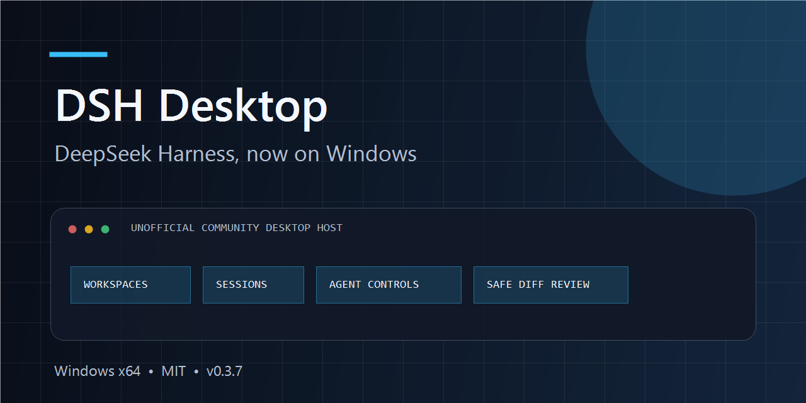
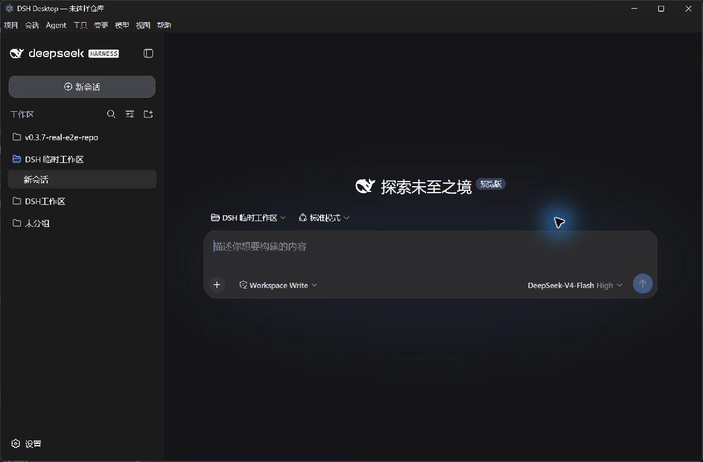

# lulu（原 DSH Desktop）

> **2026-10-09 交付完成：lulu 1.1.14 / Harness 0.2.1-alpha.1 已覆盖本机并公开 Pre-release。** 本地 912/912、发行提交 CI、四份文件匿名下载与完整 SHA-256 均通过，原会话/草稿/Key/代理保全，Obsidian 已同步。本次确认的 Windows 11 x64 范围内已达到 Stable 就绪条件，但**未晋升，Stable 仍为 1.1.12**。安装包未签名，既有主机风险和其他未验证范围继续披露。详见[公开交付证据](docs/LULU_PUBLIC_DELIVERY_2026-10-09.md)。以下旧日期段落仅为历史。

日常迭代下载：[1.1.14 发布页](https://github.com/hejiahang0001-oss/dsh-desktop/releases/tag/v1.1.14) · [安装版](https://github.com/hejiahang0001-oss/dsh-desktop/releases/download/v1.1.14/DSH-Desktop-Setup-1.1.14.exe) · [便携版](https://github.com/hejiahang0001-oss/dsh-desktop/releases/download/v1.1.14/DSH-Desktop-Portable-1.1.14.exe)。Stable 通道不随日常迭代自动变化。

> 2026-10-09 当前：本机已安装 **lulu 1.1.14 / Harness 0.2.1-alpha.1**；真实资料托盘退出后28份历史、7条草稿、Key及代理保留检查通过，临停集成已精确恢复。正在完成源码PR/CI及四资产公开Pre-release；尚未公开，Stable仍为1.1.12。详见[交付收尾记录](docs/LULU_RELEASE_READINESS_2026-10-09.md)。下方状态均保留其历史时点。

> 2026-10-09 本机已覆盖为 **lulu V1.1.14 / Harness 0.2.1-alpha.1**，使用原安装目录与资料。安装前后108项选区权限/身份不变；安装态插话清空、官方Stop、托盘正常退出及历史落盘补证通过，原资料只读启动检查通过。仍待原资料正常退出后的保留比较、临停集成恢复及公开发行，**未公开、尚非Stable-ready，Stable仍为V1.1.12**。详见[本机安装验收](docs/LULU_INSTALLED_ACCEPTANCE_2026-10-09.md)；下方日期段落是历史状态。

> 2026-10-08 当前候选：lulu V1.1.14 已部署固定 Harness 0.2.1-alpha.1，完整源码 911/911，Setup/Portable 构建与负载、便携版启动/终端/自行清理通过；最终包 Office/附件/布局、安全退出、真实模型审批和工作区交接、受控代理已有分项实测。归档恢复、备份覆盖及公开下载仍待验，**尚未 Stable-ready，未发布**。本机仍 V1.1.13，Codex 集成占用旧版运行时，未强制结束。用户确认本次仅承诺 **Windows 11 x64**；详见 [当前验收与交付状态](docs/LULU_STABLE_ACCEPTANCE_2026-10-07.md)。下方旧日期段落保留历史，不代表当前门禁。

> 2026-10-07 原图视觉切片：用户已直接上传原图，透明全身噜噜接入界面与等比例 Windows 图标，蓝底图仅作参考。同步修复新内核品牌标记接线、分离浮窗图标继承和本地表单状态样式；不改业务、凭据、关闭托盘策略或数据身份。源码验证与截图以 [本轮证据](docs/LULU_VISUAL_FOLLOWUP_2026-10-07.md) 为准。**未覆盖本机安装、未打包发布**；下方“素材继续核对”为此前时点。

> 当前 V1.1.14 源码增量：主窗口 × 改为隐藏到右下角托盘，托盘“退出 lulu”继续走安全退出；原生控件专项已验，尚未安装。原版噜噜高清素材与图标继续核对，不用近似角色替代。见 [交互与素材记录](docs/LULU_TRAY_AND_MASCOT_2026-10-07.md)。

> 2026-10-07 正式源码候选：V1.1.14 已接入固定 **Harness 0.2.1-alpha.1**，已生成并实际运行 Windows 候选包；完整验收仍未通过，跨会话待发送附件丢失必须修复，Office UI 验收需适配新版契约。**这不是已覆盖安装或公开发布**：本机安装记录 V1.1.13、Stable V1.1.12 不变。最新分层证据见 [正式新核接线](docs/HARNESS_FORMAL_BINDING_2026-10-07.md)，下方旧段落保留原日期状态。

> 2026-10-07 晚间：同一 V1.1.14 已生成官方 0.2.1-alpha.1 的独立运行库（289 个本地组件、14,173 文件）；冻结安装、667 项审计、五组实际原生组件及隔离宿主认证/重启会话恢复通过。正式接线、完整界面和安装态仍待验收；测试失败与修复分别记录在 [桌面运行库装配](docs/HARNESS_DESKTOP_RUNTIME_2026-10-07.md)。**正式固定内核、本机安装和 Stable 未变；不是新版安装包已交付。**

> 2026-10-07 私有 PS7 候选已整合：官方 7.6.6 的 658 文件来源与签名通过，15 个窄源码文件、实际 PIPE/PTY 各 7 项和 40 文件干净重放已验；整合后根测试 706 项中 704 通过、2 原有跳过、零失败。修正 pnpm 隐式安装问题后已从缓存恢复并核对 Office/HCS/sharp/MCP 字节。新输入官方完整构建及原失败的两条真实 Loader 用例已通过；下一步为官方闭包及完整宿主/安装验收。正式内核与 Stable 未变。详见 [本轮证据](docs/HARNESS_PRIVATE_POWERSHELL_2026-10-07.md)，下方旧段落保留其历史时点。

> 2026-10-07：继续 V1.1.14 / 0.2.1-alpha.1 隔离候选。Office 来源差异审查、原生负载和真实预览/导出通过；候选安全依赖分组修复及真实消费者通过，662 项审计零已知漏洞。Windows 沙箱 shell 仍待完整验收及私有 PS7 运行时范围决定。**没有换正式内核、覆盖安装或发布，Stable 不变。** 当前事实见 [Stable 就绪记录](docs/HARNESS_STABLE_READINESS_2026-10-07.md)；下方旧日期段落不代表当前全部门禁。

> 2026-10-06 晚间：用户允许继续隔离构建/兼容验证，不包含换核或发行。0.2.1-alpha.1 完整源码构建已通过；新增 source-map-js 1.2.2 单项安全修复，新审计 662 项仍有 1 high。发现 Windows Office 原生可选包下载失败但 pnpm 退出 0，Office 尚不可验收。正式 alpha.2、安装与 Stable 不动。最新阶段结果见 [隔离构建记录](docs/HARNESS_021_BUILD_2026-10-06.md)。下方早间记录保留历史时点。

> 2026-10-06：官方仍为 0.2.1-alpha.1。真实官方事件导出模块与显式缓存对照两轮各 4/4 通过，已检查的默认导出路径不调用缓存；不是完整产品安全验收，未豁免未撤回公告。候选与正式内核不改，未打包、安装或发布。下一步为限定风险裁决，见 [本轮范围与证据](docs/HARNESS_021_CACHE_REACHABILITY_2026-10-06.md)。

> 2026-10-05：仍为未发布 V1.1.14，当前适配目标 Harness 0.2.1-alpha.1；正式绑定仍为 0.1.6-alpha.2。新依赖 4.3.0 未能证明解决残余安全门禁，Office 精确来源仍待核实；未换核、打包、覆盖安装或公开发布。见 [本轮复核](docs/HARNESS_021_SECURITY_RECHECK_2026-10-05.md)。下方日期段落保留历史状态。

> 2026-10-03：按用户确认完成本地 lulu 视觉候选，采用指定的水豚噜噜形象；现有数据身份、功能和内核不变。仍为未发布 V1.1.14，未打包或覆盖安装；第三方角色公开分发授权尚未核实。验收进度与来源见 [视觉改造记录](docs/LULU_VISUAL_REBRAND_2026-10-03.md)。下方 DSH 名称及日期段落保留历史事实。

> 2026-10-02：V1.1.14仍为未发布候选，目标Harness 0.2.0-rc.2。已验证候选输入准备和工作台重试反馈；正式绑定仍为0.1.6-alpha.2，尚未换核、覆盖安装或发布。详见[本轮边界与证据](docs/ITERATION_2026-10-02.md)。下方日期段落为历史状态。

> 2026-09-27：官方仍为 0.1.7-rc.2，继续同一 V1.1.14。shell-env 已按执行所属会话生成独立工作目录快照，专项 2/2；全量 634 项、632 通过、2 跳过、零失败，前后源码摘要一致。根生产审计 5 包零发现。仅环境绑定窄修，显式路径授权、真实 Office/Wiki 与完整交付门禁仍开放；未换核、打包、覆盖安装或发布，安装 V1.1.13 与 Stable V1.1.12 不变。见 [本轮证据及下一步](docs/HARNESS_SHELL_BINDING_2026-09-27.md)。

> 2026-09-26 reuse decision: keep this independent desktop host and use official capabilities wherever equivalent. Retired unused desktop file listing/text/media byte APIs; the existing official file preview bridge and guarded search remain. Official Office generation/checking is the next integration target, retaining distinct safety, backup and receipt semantics. This is still unpublished V1.1.14 source, not a new installed build. See the [reuse checklist](docs/OFFICIAL_DESKTOP_REUSE_2026-09-26.md).

> 2026-09-26: V1.1.14 remains unpublished, targeting **0.1.7-rc.2** without adopting it yet. The desktop session-state bridge now consumes official inbox/jobs contracts (21 focused checks); six real local proxy/SSE checks passed twice. A stale workspace binding and tool-unload cleanup remain open, alongside full runtime and delivery gates. Fixed **0.1.6-alpha.2**, installed V1.1.13 and Stable V1.1.12 are unchanged. See the [bounded checkpoint](docs/HARNESS_RC2_BRIDGE_PREFLIGHT_2026-09-26.md).

> 2026-09-25: V1.1.14 remains unpublished. Target **0.1.7-rc.2** passed nine isolated configuration/credential tests and a 58-dependency probe audit. Real profile migration and desktop IPC were exercised with synthetic credentials and mocked transport; full runtime/model/proxy/plugin and delivery gates remain open. The product still pins **0.1.6-alpha.2**; no installer, overwrite or release. See the [rc.2 assessment](docs/HARNESS_UPSTREAM_v0.1.7-rc.2.md). Earlier evidence applies only to its stated runtime.

> V1.1.13 (`DSH-Desktop-Setup-1.1.13.exe`) is **installed and verified locally; publication is paused at a private draft because Portable checks failed**, adapting fixed Harness `0.1.6-alpha.1`. The official terminal is the primary entry; the consent-based compatibility terminal remains explicitly labelled. Extra canonical session-log upload is disabled in the desktop overlay. See the [release notes](docs/RELEASE_NOTES_v1.1.13.md). The Stable download below remains V1.1.12 until explicitly promoted.

> [V1.1.12 Stable](https://github.com/hejiahang0001-oss/dsh-desktop/releases/tag/v1.1.12) is installed, verified and promoted by the maintainer on 2026-09-12. The four original release assets are unchanged. Old installer assets have been removed; source tags, release notes and verification history are retained.

<p align="center">
  
</p>

<p align="center">
  <strong>An unofficial Windows desktop host for DeepSeek Harness.</strong><br>
  Open local repositories, keep sessions, control the running agent, and review changes without rebuilding the official agent loop.
</p>

<p align="center">
  <a href="https://github.com/hejiahang0001-oss/dsh-desktop/releases/latest/download/DSH-Desktop-Setup-1.1.12.exe"><strong>Download for Windows</strong></a>
  · <a href="#quick-start">Quick start</a>
  · <a href="#中文说明">中文说明</a>
  · <a href="DSH_DESKTOP_ITERATION_PLAN.md">Roadmap</a>
</p>

<p align="center">
  <a href="https://github.com/hejiahang0001-oss/dsh-desktop/releases"></a>
  <a href="https://github.com/hejiahang0001-oss/dsh-desktop/actions/workflows/ci.yml"></a>
  <a href="LICENSE"></a>
  
</p>

> [!IMPORTANT]
> DSH Desktop is an independent community project. It is not affiliated with, endorsed by, or maintained by DeepSeek. V1.1.12 Stable pins `dsh-v0.1.5-rc.2` at `fb2c4b9e698e30edb738bca4cf0618587db7d203` with the documented `desktop-security-1` dependency fixes. The desktop Stable label does not change Harness's developer-preview status.

## Why DSH Desktop

2026-09-23: the same unpublished V1.1.14 candidate is preparing for released Harness `0.1.7-alpha.2`; the active runtime is still `0.1.6-alpha.2`. Settings-migration backup coverage is fixed (621 passed / 2 skipped in the final source suite). V4, Messages-only, new-runtime and delivery gates remain unverified; no new installer or release. See the [new preflight](docs/HARNESS_UPSTREAM_v0.1.7-alpha.2.md). Existing evidence below is not acceptance of the new target.

V1.1.14 is an unpublished source candidate for Harness `0.1.6-alpha.2`. Its 621 source tests and real source-mode Office sidebar preview pass, but package/install and Office-kit source-availability gates remain open. `DSH-Desktop-Setup-1.1.14.exe` is the planned filename, not a currently available download. See the [candidate notes](docs/RELEASE_NOTES_v1.1.14.md). The installed daily build remains V1.1.13; Stable downloads remain V1.1.12.

V1.1.12 (`DSH-Desktop-Setup-1.1.12.exe`) is the current Stable and is installed and verified locally. It adapts Harness `0.1.5-rc.2`, official Markdown/code/image/HTML/PDF previews and `present` deliverables. Duplicate ordinary desktop previews are removed; bounded search, Git Review, legacy references, Wiki and Office validation/receipts remain. Eight exact runtime security fixes are documented without changing upstream application sources. See the [release notes](docs/RELEASE_NOTES_v1.1.12.md) and [validation evidence](docs/VALIDATION.md).

Session V3 upgrades require an independent pre-upgrade data backup. Do not let an older executable resume an upgraded active profile.

V1.1.9 (`DSH-Desktop-Setup-1.1.9.exe`) strengthens the existing Word, Excel and PowerPoint tools with shared package/XML safety checks and verified on-disk delivery receipts. It preserves the Wiki workflow and official Harness chat controls. See the [release notes](docs/RELEASE_NOTES_v1.1.9.md) and [validation evidence](docs/VALIDATION.md) for current acceptance and publication status.

DeepSeek Harness already provides the agent and Web UI. DSH Desktop adds the Windows product shell around it:

- **Native workspace flow** — open a local Git repository with `Ctrl+O`, remember recent repositories, and bind the matching Harness workspace and session.
- **Persistent sessions** — create, search, resume, rename, archive, and branch sessions while keeping Harness as the source of truth.
- **Agent visibility and control** — see whether the agent is idle, running, waiting for approval, or unavailable; stop or redirect a running turn from native menus.
- **Official running-turn controls** — let Harness own normal queue submission, the queued-message up-arrow, `Ctrl+Enter` steer and Stop; desktop menus only focus or invoke the matching official control and do not maintain a second queue protocol.
- **Authenticated upstream compatibility** — exchange the Harness one-time loopback token for a same-origin browser session, redact it from public state and logs, and use the official Remote HTTP and `session/control` protocols without exposing arbitrary endpoints to the Renderer.
- **Persistent Git review panel** — keep a bounded real Diff beside Harness, resize or hide the panel, and accept or reject one file or a safe batch while protecting pre-existing edits.
- **Native Git delivery center** — inspect the active repository, branch, upstream, ahead/behind counts, staged and unstaged work, recent commits, and public GitHub PR checks; create a local commit only from already-staged content after a second fingerprint check and native confirmation.
- **Workspace file browser** — lazily browse the active Harness workspace, search bounded filenames, open safe text files in a read-only Quick Look surface, and reveal the selected Diff file in the tree.
- **Isolated workspace terminal** — open an explicitly confirmed persistent Windows PowerShell PTY in the native dock or a separate window. Harness can request a bounded read for the exact foreground session after native confirmation, but cannot start, write, resize or stop the PTY; the software-managed DeepSeek Key remains outside the terminal environment.
- **Integrated application preview** — open workspace HTML through a software-managed random loopback port or connect to an existing localhost development server, with explicit ready/offline/stopped states and owned-port cleanup.
- **Image and PDF Quick Look** — safely inspect PNG, JPEG, WebP, GIF, and PDF files in memory with fit, zoom, and PDF page controls; supported mislabelled images are identified by their real format.
- **Global command palette** — press `Ctrl+Shift+P` to search and run a fixed, keyboard-accessible allowlist of workbench actions without exposing arbitrary shell or JavaScript execution.
- **Recoverable layout** — scale the complete interface from 80% to 140%, reset all panels and dimensions in one action, and retain compact 1024×720 keyboard access.
- **Automatic code checkpoints** — snapshot the current repository through a temporary Git index before an Agent turn, deduplicate unchanged state, exclude credential-like paths, and leave the branch, working tree, and real index untouched.
- **Confirmed checkpoint recovery** — preview a bounded restore, create a safety point, preserve sensitive files and their staged state, recycle newly created files, and recover without moving the branch or HEAD.
- **Bounded checkpoint history** — inspect the latest twelve verified local safety points, compare their real impact, and choose an older target without exposing commit or ref input.
- **Checkpoint-linked conversation branches** — associate new checkpoints with the selected completed Harness turn, then either restore code only or create and switch to an official child session while preserving the source conversation.
- **Visible context sources** — inspect the Code preset, desktop language policy, project-rule candidate chain, and durable-session boundary in a local read-only window without exposing hidden prompts, credentials, or rule contents; Harness remains authoritative for content deduplication and prompt-budget inclusion.
- **Harness-backed extension center** — inspect Skills, Plugins, Hooks, and MCP through one local metadata-only surface. Official live inventory remains authoritative; source, scope, permission, version, disabled/loading/failed states, fixed runtime closure, Profiles, controlled lifecycle actions, and rollback points are kept visible without reading Skill prose, plugin configuration, Hook scripts, MCP keys, or session content.
- **Editable Word delivery** — invoke the bundled `/word-docx` Skill from Tools or the command palette to create and structurally inspect editable DOCX files with headings, lists, tables, workspace PNG/JPEG images, headers, and footers, or perform exact rollback-backed text replacement without an online Office service.
- **Editable Excel delivery** — invoke the bundled `/excel-xlsx` Skill to create, import, edit, and strictly inspect editable XLSX workbooks with typed cells, multi-sheet formulas, styles, filters, frozen panes, and explicit reconciliation checks without an online Office service.
- **Editable PowerPoint delivery** — invoke the bundled `/powerpoint-pptx` Skill to create and strictly inspect editable widescreen PPTX presentations with native text, shapes, tables, charts backed by embedded Excel data, workspace PNG/JPEG images, a real slide master, two layouts, and speaker notes, or perform exact rollback-backed text replacement.
- **Unified Office delivery center** — see Word, Excel, and PowerPoint readiness, supported editable structures, safety boundaries, and fixed invocation actions in one local-only window alongside the worktree, Tasks/Subagents, and extension integration chain.
- **Selected DSH history to Wiki** — choose up to eight completed ordinary sessions from the active workspace, inspect change and redaction counts, and let `/wiki-history-ingest dsh` distill only user/assistant text after a separate preview, validation, and confirmation flow.
- **Guided local Wiki center** — configure a Markdown vault through a three-step first run, inspect structure, managed pages, source freshness and verified synchronization, and maintain exactly six provenance-bound release-knowledge pages. Protected recovery never deletes a manifest entry or overwrites a human page automatically; query and mutation stay blocked until the exact recovery state is resolved.
- **Redacted support and verified backup** — export a support JSON without keys, proxy values, full paths, transcripts, or log text; create and validate a SHA-256 manifest backup of sessions and settings while excluding software credential files, proxy settings, caches, logs, and bundled runtimes. Session content is preserved byte-for-byte and is not redacted.
- **Controlled extension installation** — install the reviewed `@nonamelego/dsh-catppuccin@0.3.1` catalog entry into the Web Profile with bundled pnpm `11.19.0`, exact-version/integrity checks, disabled lifecycle scripts, native confirmation, credential isolation, health verification, and rollback. No arbitrary package or pnpm command input is exposed.
- **Isolated Git worktrees** — create a generated DSH-owned branch and worktree, switch the active Harness workspace, and safely reclaim only DSH-owned worktree directories. External worktrees stay read-only; dirty removal creates a private recovery checkpoint and retains the branch.
- **Harness-native tasks and subagents** — inspect the authoritative subagent tree, live background-job mirror, approval count, and working-directory sharing risk; open the exact child transcript, queue a bounded follow-up to a continuable child, or request interruption without treating acknowledgement as completion.
- **Independent background schedules** — create explicitly authorized local tasks in separate worktrees, with a new conversation per run, exact run history, daily caps, approval notifications, tray operation and recovery without blind resubmission. Full exit stops scheduling; worktrees are not VMs and results still need review.
- **Isolated Side Chat** — fork the selected completed ordinary Harness session into a separate temporary browser partition with `Ctrl+Shift+S`; the main selection, Plan state, permissions, workspace, and pending work remain unchanged, while the side session is fixed to Workspace Write / Ask.
- **In-app network settings** — choose direct access, the current Windows system proxy, or a credential-free custom HTTP(S) proxy; test DeepSeek connectivity before saving and keep loopback services and the integrated terminal outside that route.
- **Reliable copy actions** — Harness can write sanitized text to the clipboard from its trusted main page, while clipboard reads, subframes, and unrelated permission requests remain denied.
- **Packaged runtime** — the installer includes pinned Node.js and Harness runtimes; users do not need to install Node.js first.
- **Constrained desktop shell** — loopback-only service, random port, renderer sandbox, context isolation, no Node integration, and restricted navigation.

<p align="center">
  
</p>

## Quick start

1. Download [`DSH-Desktop-Setup-1.1.12.exe`](https://github.com/hejiahang0001-oss/dsh-desktop/releases/latest/download/DSH-Desktop-Setup-1.1.12.exe).
2. Install and launch DSH Desktop. The current installer is not code-signed, so Windows SmartScreen may show a warning.
3. Open **Project → Open code repository…** or press `Ctrl+O`.
4. Open **Model** to configure your DeepSeek API key, then start a Harness session.

The application stores profiles, sessions, settings, logs, and repository state under `%APPDATA%\DSH Desktop`; upgrades do not remove this data.

## Current releases

**V1.1.12 official preview and delivery adaptation** delegates ordinary previews and file delivery to Harness RC2 through public plugin services. Installed tests cover five preview formats, three Chinese PDF pages, keyboard search, real queue/steer/stop/present, Excel/Word reads and unchanged user data. The installer remains unsigned, with automatic installation disabled; Portable cold-start performance remains a known limitation. See the [release notes](docs/RELEASE_NOTES_v1.1.12.md), [validation record](docs/VALIDATION.md), and [upstream compatibility map](docs/HARNESS_UPSTREAM_v0.1.5-rc.2.md).

**[V1.1.12 Stable](https://github.com/hejiahang0001-oss/dsh-desktop/releases/tag/v1.1.12)** is the maintainer-approved stable baseline and GitHub `Latest release` as of 2026-09-12. Promotion reuses the original tested binaries and SHA-256 values without rebuilding or reinstalling. See [release notes](docs/RELEASE_NOTES_v1.1.12.md), [credential migration](docs/KEY_STORAGE.md) and [verification history](docs/VALIDATION.md).

Download the [Windows installer](https://github.com/hejiahang0001-oss/dsh-desktop/releases/download/v1.1.12/DSH-Desktop-Setup-1.1.12.exe), [portable build](https://github.com/hejiahang0001-oss/dsh-desktop/releases/download/v1.1.12/DSH-Desktop-Portable-1.1.12.exe), or [SHA-256 checksums](https://github.com/hejiahang0001-oss/dsh-desktop/releases/download/v1.1.12/SHA256SUMS-v1.1.12.txt). There is currently no newer public Pre-release; future iterations will use that separate channel.

**Historical releases:** on 2026-09-12 the maintainer requested removal of all older installer assets, including V1.1.0 and V1.0.5. Release records and source tags remain available, but their old installer links no longer provide downloads. Local obsolete packages and duplicate transfer files were sent to the Windows Recycle Bin; verification records and independent user-data backups were retained.

### Release channels

- **Stable:** V1.1.12 is the stable baseline and GitHub `Latest release`, explicitly promoted by the maintainer on 2026-09-12. Stable changes only after explicit approval of a tested Latest build.
- **Latest:** validate each planned iteration before overwriting or publishing it as a GitHub Pre-release. Follow the maintainer's explicit authorization, including standing authorization for routine iterations; request new approval when authorization is absent or the action exceeds its scope. Latest can advance without replacing Stable.
- Before upgrading, retain an independent backup of application data. Session v2 writes are not readable by older runtimes: do not point Stable or another older version at an already migrated active profile. Roll back only with a separate compatible pre-upgrade data backup; keeping an installer is not a data-downgrade guarantee.

```text
Open repository → run or approve the agent in Harness
→ inspect bounded real Git Diff in the persistent right panel
→ reveal the changed file in the lazy left tree and inspect safe text
→ open workspace HTML on a software-managed random loopback port
→ or connect to an existing 127.0.0.1 / localhost development server
→ inspect supported images and PDFs locally with fit, zoom, and page controls
→ press Ctrl+Shift+P to search, toggle, or focus existing workbench surfaces
→ open the persistent PTY in a local-only security window that Harness cannot write
→ scale the complete interface from 80% to 140% or reset every panel and dimension
→ automatically record the pre-turn working tree and index state in private Git refs
→ press Ctrl+Alt+R, inspect the native restore summary, and recover after a safety checkpoint
→ or press Ctrl+Alt+H to compare the latest twelve verified local points
→ restore only code, or create an official Harness child session from a linked completed turn
→ open Tools → Context sources to inspect the effective rule and session layers
→ open Tools → Extension center to inspect Skills, Plugins, Hooks, MCP, fixed closure, and Profile lifecycle
→ open Tools → Office delivery center to see Word, Excel, PowerPoint, and the current-version integration chain together
→ open Tools → Wiki center to query local knowledge, capture one completed conclusion, preview the active project's knowledge delta, or select DSH history for controlled ingestion
→ open Tools → Create or edit Word document to invoke the bundled /word-docx Skill
→ open Tools → Create or edit Excel workbook to invoke the bundled /excel-xlsx Skill
→ open Tools → Create or edit PowerPoint presentation to invoke the bundled /powerpoint-pptx Skill
→ press Ctrl+Shift+S to fork the completed main turn into an isolated Side Chat window
→ while an Agent is running, press Ctrl+Enter to steer the official turn, or use the official Stop control
→ press Ctrl+, to choose direct, Windows system, or custom HTTP(S) proxy and test connectivity
→ reload, open in the browser, stop, and visibly distinguish owned from external ports
→ accept/stage or reject one file or a safe batch
```

The pinned runtime includes the complete official dependency closure required by the default Web profile, but it does not activate every package in the upstream monorepo or silently bundle community plugins. See the [V1.0 upstream map](docs/HARNESS_UPSTREAM_v0.1.2-alpha.1.md), [plugin inventory boundary](docs/HARNESS_PLUGIN_INVENTORY.md), [third-party license inventory](docs/THIRD_PARTY_LICENSES.md), [update/signing assessment](docs/UPDATE_AND_SIGNING_ASSESSMENT.md), [validation details](docs/VALIDATION.md), and [V1.0.1 release notes](docs/RELEASE_NOTES_v1.0.1.md).

## Security and current limits

- The Windows installer is not code-signed yet.
- Software-managed DeepSeek credentials use encrypted `.credentials.dpapi.json` storage and take priority over environment variables; ordinary backups exclude credential files. Keys require re-entry on another Windows account or computer. See [Key storage and migration](docs/KEY_STORAGE.md).
- V1.1.12 Stable embeds Harness `0.1.5-rc.2`, which remains a developer preview rather than a stable upstream API guarantee. DSH Desktop reports tool failures and never switches to Full Access automatically; validation covers key product paths but cannot prove every upstream plugin path. Stable promotion does not imply code signing, a second-machine test or 24-hour aging.
- V0.4.8 retains PNG, JPEG, WebP, GIF, and PDF preview with separate 24 MiB image and 40 MiB PDF limits. Device presets, browser developer tools, and remote URL preview are not included. Credential-like paths, links/junctions, traversal, and files outside the workspace remain blocked.
- V0.5.20 Word editing performs exact replacement inside one OOXML text node; it does not guess across mixed-format runs, convert `.doc`, or provide tracked changes, comments, equations, or arbitrary Word DOM editing. Embedded images are limited to bounded workspace PNG/JPEG files.
- V0.5.21 Excel supports bounded `.xlsx` creation, CSV import, explicit cell updates, formulas, styles, filters, frozen panes, and reconciliation. It does not execute macros, external links, connections, query tables, Power Query, arbitrary scripts, or legacy `.xls`; unsupported or risky content fails strict inspection.
- V0.5.22 PowerPoint supports bounded editable `.pptx` creation and exact text replacement within complete text runs. It does not claim arbitrary PowerPoint DOM or template editing, animations, SmartArt, equations, video/audio, macros, OLE/ActiveX, legacy `.ppt`, password-protected files, or pixel-identical rendering across every Office version.
- The terminal provides one persistent PowerShell PTY session with ANSI rendering in an isolated local window. Closing the window stops the PTY; terminal tabs and split panes are not included yet. V0.5.7 lists at most twelve local code checkpoints; only checkpoints created with a selected session and completed turn can create a conversation branch. Older and blank-session checkpoints remain code-only. In-place conversation rewind and remote checkpoint sync are not included. Git accept/reject, code recovery, conversation branching, and proxy changes stay disabled while the PTY or Agent is active. Custom proxy authentication and SOCKS are not included in this release.

Read [SECURITY.md](SECURITY.md) before reporting a vulnerability. Architecture and product boundaries are documented in [the iteration plan](DSH_DESKTOP_ITERATION_PLAN.md).

## Development

Requirements: Windows x64, Node.js `v24.19.0`, and pnpm.

```powershell
pnpm install --prod=false
pnpm electron:fetch
pnpm runtime:fetch
pnpm runtime:deploy
pnpm test
pnpm start
```

Build the unpacked application or NSIS installer with:

```powershell
pnpm pack:win
pnpm dist:win
```

`electron:fetch` and `runtime:fetch` accept only pinned official archives with pinned SHA-256 values. `runtime:deploy` builds a fixed, link-free production closure from the lockfile.

Contributions are welcome. Start with [CONTRIBUTING.md](CONTRIBUTING.md), an issue labelled `good first issue`, or a question in GitHub Discussions.

## 中文说明

DSH Desktop 是一个面向 Windows 的 **DeepSeek Harness 非官方社区桌面宿主**。它不重新实现 Agent，而是在官方 Harness Web UI 外增加 Windows 原生项目、会话、模型、Agent、工具和变更菜单。

[V1.1.12 已按维护者指令晋升为 Stable](https://github.com/hejiahang0001-oss/dsh-desktop/releases/tag/v1.1.12)，沿用已验收安装包，不重新构建或安装。本次仅保留 V1.1.12 的发布文件，旧版本安装附件已从 GitHub 移除，本地旧包与重复传输文件已进入回收站；源码标签、发布历史、验收记录和用户数据备份保留。独立后台任务等前序能力继续保留：独立任务需要 Git，普通文档不需要 Git，完全退出软件后不执行定时任务。跨电脑和回退旧版本的 Key 边界见[迁移说明](docs/KEY_STORAGE.md)。

发布通道规则：V1.1.12 为当前 Stable 和 GitHub `Latest release`，于 2026-09-12 经维护者明确授权晋升。后续迭代仍走独立 Latest / Pre-release，不自动修改 Stable；当前没有比此 Stable 更高的公开预发布版本。Stable 只有在维护者明确下达“更新 Stable”命令后才晋升，不代表安装器已签名或已完成 24 小时老化，边界见[发布说明](docs/RELEASE_NOTES_v1.1.12.md)。

本轮 [V1.1.12 Stable](https://github.com/hejiahang0001-oss/dsh-desktop/releases/tag/v1.1.12) 的内核固定为 `0.1.5-rc.2`，普通 Markdown、代码、图片、HTML、PDF 预览和 `present` 文件交付统一采用官方能力，删除重复普通预览。保留文件搜索、Git Review、旧引用、草稿、Office/Wiki 工具及安全收据。原发布的 602 项源码测试记录和安装态五类预览、真实插话/停止、Excel/Word 读取均通过；晋升未更改二进制、Key 或用户会话。四项资产再次通过匿名完整下载，默认下载入口已指向 V1.1.12。已验证范围见[验证记录](docs/VALIDATION.md)。

- 选择本地代码仓库并同步到同路径 Harness Workspace；
- 复用或创建该工作区的会话；
- 从桌面菜单进入官方 Plan 模式，定位 Harness 的执行确认，并在批准后执行；
- 查看 Agent、工具调用和测试状态；
- 在常驻右侧面板查看真实 Git Diff，逐文件或批量接受并加入 Git 暂存区，或安全拒绝修改；
- 在与 Harness 相同的工作区中按需展开左侧文件树、搜索相对路径，并用只读浮层查看安全文本；
- 从右侧 Diff 点击“查看文件”，自动清空搜索、展开父目录、选中文件并打开只读预览；
- 图片支持适合窗口和 25%–400% 缩放；PDF 支持页码、上一页/下一页、适合窗口和缩放；文件仅在本机内存中打开；
- 图片内容按真实 PNG/JPEG/WebP/GIF 签名校验；扩展名写错但内容仍为受支持图片时安全打开并提示真实格式，跨类型伪装继续阻止；
- `Ctrl+Shift+P` 从任意工作台位置打开命令面板，支持搜索、上下选择、Enter 执行、Escape 关闭和原焦点恢复；
- 命令仅来自固定白名单，可聚焦对话、新建 Harness 会话、切换或聚焦文件/预览/Diff、打开安全终端窗口以及重载页面，不解释或执行用户输入的任意命令；
- `Ctrl+-`/`Ctrl+=` 在 80%–140% 范围缩放整个 Harness 与工作台，`Ctrl+0` 恢复 100%，选择会持久保存；
- `Ctrl+Alt+0` 一次恢复面板开关、宽高和 100% 缩放；紧凑高度自动为对话区保留空间，不覆盖用户在大窗口下保存的终端高度；
- 用户实际点击、输入或发送 Harness 消息时自动建立当前 Agent 回合前的 Git 检查点；页面启动自动聚焦不会建点，若发送时仍在建立，识别到的发送动作会等待后再继续；
- 检查点使用临时 Git 索引与私有 `refs/dsh/checkpoints/*`，不切换分支、不修改 HEAD、工作树或真实索引；相同状态不重复保存；
- `.env`、`.credentials*`、私钥和 secrets 等敏感路径不会写入检查点，恢复时其工作树内容及当前暂存状态均保持不变；
- `Ctrl+Alt+R`、视图菜单或命令面板可恢复最近代码检查点；原生提示先列出影响路径、将进回收站的新文件和保留的敏感路径，且默认选择取消；
- `Ctrl+Alt+H` 打开最近 12 个本地检查点，显示来源、时间、当前影响、索引、回收站和会话回合关联摘要；
- “只恢复代码”继续使用原生默认取消确认和 safety checkpoint；“建立会话分支”调用 Harness 官方 `session.fork`，按已完成回合建立并切换到子会话，原会话、当前代码和 Git 索引不变；
- 旧版检查点、无当前会话或尚未完成首个回合时建立的检查点仍可恢复代码，但不会显示为可建立会话分支；
- `Ctrl+Shift+W` 管理 DSH 创建的隔离工作树；外部工作树只读，回收有修改的受管工作树前建立私有恢复点并保留分支；
- `Ctrl+Shift+A` 打开“任务与子代理”，查看 Harness 确认的主任务、子代理、后台任务、等待确认和工作目录共享；可继续子代理支持受控补充消息和当前轮次中断，一次性子代理保持只读；
- `Ctrl+Shift+S` 从已完成的普通主会话打开 Side Chat；主会话选择、工作区、Plan、权限和待办不变，Side Chat 固定为 Workspace Write / Ask，并提示修改代码时优先使用隔离工作树；
- 历史界面只接收严格检查点 ID 和有界摘要，不接收 commit/tree/ref、文件路径或任意 Git 参数；伪造或损坏的私有 ref 被忽略；
- `Ctrl+,`、模型菜单或命令面板可打开“网络与代理”，选择直连、Windows 系统代理或无账号密码的自定义 HTTP(S) 代理，并在保存前测试 DeepSeek API 连通性；
- 软件代理只传给 Harness 外部请求；`127.0.0.1`、`localhost`、`::1` 与集成终端不受影响，软件设置会隔离继承的代理环境变量；
- Harness 主页面可执行经过清洗的剪贴板写入，因此对话复制按钮恢复可用；读取剪贴板、子框架及其他网页权限仍保持拒绝；
- 恢复前自动建立 safety checkpoint，分支和 HEAD 不移动；失败时自动回到恢复前状态，成功后立即再次恢复可撤销本次恢复；
- 从 HTML 的只读 Quick Look 直接进入应用预览，由软件在当前工作区启动随机 `127.0.0.1` 端口并加载相对资源；
- 连接已经运行的 `127.0.0.1`、`localhost` 或 `::1` 开发服务器，显示可用、离线、失败和停止状态；外部端口只监控、不代替用户结束进程；
- 关闭预览、切换仓库或退出软件时释放软件自己启动的端口；支持重新加载、浏览器打开、`Ctrl+Alt+P` 开关与 `Ctrl+Alt+L` 聚焦；
- 调整、关闭和恢复审查面板，布局宽度在页面重载和应用重启后保留；
- 经一次原生风险确认后，在与 Harness 相同的工作目录中启动持久 PowerShell PTY，连续命令、交互提示、Shell 状态、ANSI 颜色和窗口尺寸均保留；
- Harness 页面重载后恢复最近 200,000 字符终端输出；终端停止时结束完整进程树并重新建立 Git 用户修改保护基线；
- 软件内保存的 DeepSeek API Key 不进入 PTY 宿主或 PowerShell 环境；终端运行期间一键接受/拒绝暂时禁用；终端开关和高度继续持久化；
- 文件面板不会跟随符号链接/目录联接，也不会显示疑似凭据、私钥、二进制、大文件或不支持编码的内容；
- 中文提问时，新回合的可见思考、工具说明、计划、进度、问题和结论默认使用简体中文，代码、命令、路径和原始输出保持原文；
- 在覆盖升级后保留工作区、会话和软件 Key 状态。

首次使用请从 [GitHub Releases](https://github.com/hejiahang0001-oss/dsh-desktop/releases) 下载 Windows 安装包。当前版本尚未代码签名，SmartScreen 可能提示风险；DeepSeek Harness 仍处于 developer preview。

## License

DSH Desktop is licensed under the [MIT License](LICENSE). DeepSeek Harness, Electron, Node.js, and other third-party components remain subject to their own licenses and notices.
